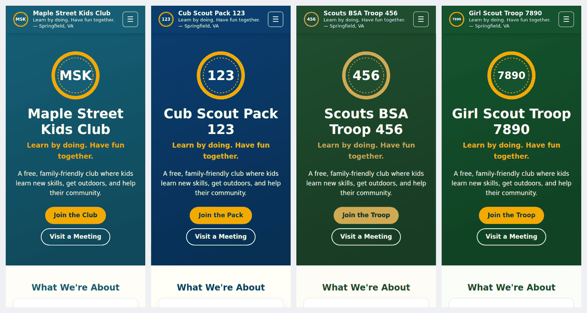

# Youth Group Website Template

A free, fast, mobile-friendly website for a **Scout pack or troop, Girl Scout troop, youth sports club
(soccer, baseball, football, basketball…), or any kids club**.
Edit one settings file, and GitHub builds and publishes the site for you. No coding, servers, or
monthly fees.



- **Cost:** $0 on GitHub Pages (or Cloudflare Pages / Vercel). An optional custom domain like `troop123.org` is about $10–20/year.
- **Time:** about 15–30 minutes from "Use this template" to a live site.
- **Skills:** you can edit a text file in your web browser. An AI coding agent can do the whole thing (see [AGENTS.md](AGENTS.md)).
- **License:** [Unlicense](LICENSE), public domain. Copy, change, and share it however you like.
- **See it first:** the [showcase and deploy guide](https://dmvthrowers.club/Scouts-Template-Site/) has live examples, including a real Cub Scout pack.

**What you get:** 10 pages (Home, About, Join, Groups, Calendar, Gallery, Resources, FAQ, Contact,
Privacy & Safety) plus a "page not found" page. Upcoming events hide themselves once they've passed.
There's an optional Google Calendar, a photo gallery, and a FAQ that shows up in Google results.
The emblem and icons are generated in your colors. Every page works on phones and is accessible
(contrast, tap targets, keyboard), privacy-friendly (no cookies, trackers, or outside fonts), and
locked down with a strict security policy. An automatic check catches mistakes before they go live.

---

## Quick start (15–30 minutes)

You need a free [GitHub account](https://github.com/signup).

### 1. Make your own copy
Click the green **Use this template** button at the top of this page, then **Create a new
repository**. Give it a name (for example `troop123-site`), keep it **Public**, and click **Create repository**.

> Public is required for free GitHub Pages hosting. Nothing private goes in this repository; it's
> the same information that's on your public website.

### 2. Turn on GitHub Pages
In your new repository: **Settings → Pages → Build and deployment → Source → GitHub Actions**.
That's the only setting you need.

### 3. Fill in your details
Open **`site.jsonc`**, click the **pencil icon** to edit, and work top to bottom. Every line has a note.

1. **`preset`**: pick your type of group:

   | Preset | For | Group name | Groups page shows |
   | --- | --- | --- | --- |
   | `kids-club` (default) | Any kids club or youth group | Club | Age groups (Explorers, Trailblazers, Leaders) |
   | `cub-scouts` | Cub Scout pack (Scouting America) | Pack | Dens: Lion → Arrow of Light |
   | `scouts-bsa` | Scouts BSA troop (Scouting America) | Troop | Patrols and ranks: Scout → Eagle |
   | `girl-scouts` | Girl Scout troop (Girl Scouts of the USA) | Troop | Levels: Daisy → Ambassador |
   | `sports-club` | Any youth sports club (use for sports not listed below) | Club | Teams by age |
   | `soccer` | Youth soccer club | Club | Teams: U6 → U14 |
   | `baseball` | Youth baseball or softball league | League | Divisions: Tee-Ball → Juniors |
   | `football` | Youth flag or tackle football club | Club | Teams: Flag → Seniors |
   | `basketball` | Youth basketball club | Club | Teams: Rookies → Seniors |

   Sports presets list coaches as **Coaches & Volunteers**, include safety rules (SafeSport training,
   concussion and weather policies), and link to the sport's national governing body. Check the age
   groups, gear list, and safety rules against your own league's rules and change what differs.

2. **`group`**: name, unit number, tagline, city, short description.
3. **`meetings`**, **`contact`**, **`cost`**: when, where, a shared email address, and dues.
4. **`leaders`**: only people who agreed to be listed. `"open": true` shows a "volunteer with us" card.
5. **`events`**: dates as `YYYY-MM-DD`. Past events disappear automatically.

When you're done, click **Commit changes**.

> **Shortcut:** the [`examples/`](examples/) folder has finished settings files. `pack-1125.jsonc`
> is a real Cub Scout pack. Copy one over `site.jsonc` and change the details.

### 4. Watch it go live
Open the **Actions** tab. "Build and deploy" takes about a minute. When it shows a green check,
your site is live at:

```
https://YOUR-GITHUB-NAME.github.io/YOUR-REPO-NAME/
```

The link also appears on the finished run and under **Settings → Pages**.

**Did the first run fail?** If the repository was created before you turned on Pages, the very
first run fails. Go to **Actions → Build and deploy → Run workflow** to run it again.

**A red X on a later run** means the automatic check found a problem, such as a typo in
`site.jsonc` or a missing photo. Click the run to see a plain-English message. Your live site
stays as it was until the problem is fixed.

---

## What to change (and where)

| To change… | Edit | Notes |
| --- | --- | --- |
| Name, tagline, town, description | `site.jsonc` → `group` | |
| Meeting time and place | `site.jsonc` → `meetings` | Building + town is enough. Don't publish home addresses. |
| Email, phone, social links | `site.jsonc` → `contact` | Use a shared email (free with Gmail). Avoid personal cell numbers. |
| Dues and financial aid | `site.jsonc` → `cost` | Plain text, so any currency works. |
| Leaders | `site.jsonc` → `leaders` | Ask before listing anyone. |
| Upcoming events | `site.jsonc` → `events` | |
| Colors | `site.jsonc` → `theme` | Any hex color. The build warns if text would be hard to read. |
| Logo | add `assets/emblem.svg` | Otherwise an emblem with your number or initials is generated. |
| Social-share image | add `assets/og-card.png` (1200×630) | Otherwise one is generated in your colors. |
| Photos | `assets/images/gallery/` + `site.jsonc` → `gallery` | See [Photos](#photos-and-kids-privacy). |
| Extra links on Resources | `site.jsonc` → `links` | |
| "Learn to Yo-Yo" card on Resources | `build.py` → `page_resources` | A small thank-you link to DMV Throwers, the club that made this template. Delete the two lines under the comment to remove it. |
| Extra FAQ questions | `site.jsonc` → `faq_extra` | |
| Group names, age levels, join steps, FAQ, safety text | `presets/<your preset>.json` | Or copy any section into `site.jsonc` to override it. |
| Words like Club/Team, Leaders/Coaches, meetings/practices | `site.jsonc` → `terms` | e.g. `"terms": { "unit": "Team", "leaders": "Coaches", "meetings": "practices", "meeting": "practice", "visit": "Try a Practice" }`. See any sports preset for the full list. |
| A whole extra section on a page | `content/<page>.html` | See [Adding your own content](#adding-your-own-content). |
| Page layout or new pages | `build.py` | One short function per page. |
| Fonts, spacing, look | `assets/style.css` | |
| Footer template credit | `site.jsonc` → `site.credit` | Small "Site template by" line. Set `false` to hide it; no credit is required. |

**Overriding preset text:** anything in `site.jsonc` wins over the preset. For example, to rename
the kids-club groups, add a `"groups": [ ... ]` list to `site.jsonc` in the same shape as in
`presets/kids-club.json`.

---

## Youth protection

The Scouts presets add a short **Youth Protection** section to the Join page: the two-adult rule, a link
to the official training, and a link to the full safety list on the Privacy & Safety page. For any other
preset, add `"youth_protection": { "show": true }` to `site.jsonc`. Add more official links with `links`
(`{ "label": "...", "url": "https://..." }`), reword the rule with `rule_text`, or set `"two_adult_rule": false`
if it isn't true for your group. Say only what your group actually does.

---

## Photos and kids' privacy

1. **Get written permission** from a parent or guardian before posting any photo of a child.
2. **Never name kids** in captions or alt text ("Scouts on a hike", not names).
3. **Resize and clean photos** before uploading: about 1200 pixels wide and under 500 KB. Strip the
   location data. On most phones, turn off location in the share options, or use a free tool such
   as [Squoosh](https://squoosh.app) in your browser.
4. Upload to `assets/images/gallery/` (**Add file → Upload files** on GitHub), then list each one in `site.jsonc`:

   ```jsonc
   "gallery": [
     { "src": "images/gallery/fall-hike.jpg", "alt": "Kids on a forest trail in autumn", "caption": "Fall Hike" }
   ]
   ```

The **Privacy & Safety** page tells families these rules and how to ask for a photo to be removed.

---

## Google Calendar (optional)

1. In Google Calendar, make a calendar for your group, then open **Settings and sharing**.
2. Under **Access permissions**, check **Make available to public** (see all event details).
   Without this, visitors see a "Sign in" box instead of your events.
3. Under **Integrate calendar**, copy the URL from inside the **Embed code** (it starts with
   `https://calendar.google.com/calendar/embed?src=`).
4. Paste it into `site.jsonc` → `"calendar": { "embed_url": "..." }`.

The site's security policy allows only Google Calendar to be embedded, and only when you set this.

---

## Adding your own content

Make a file named after a page in the `content/` folder: `content/about.html`,
`content/index.html` (home), `content/join.html`, and so on. Its HTML is added as a new section at
the bottom of that page. Use plain HTML tags like `<h2>`, `<p>`, `<ul>`, and `<a>`. Inline
`<script>`, `<style>`, and `style="…"` are blocked by the security policy, and the automatic check
will flag them. Put styles in `assets/style.css` instead. See [content/README.md](content/README.md)
for an example.

---

## Custom domain (optional, about $10–20/year)

Your site works fine at its free GitHub address. A short domain like `troop123.org` is easier to
put on flyers. You can add one any time; the free address keeps working until you switch.

**Choosing and buying one**
- Any registrar works (Porkbun, Cloudflare, Namecheap, Squarespace…). Buy only the domain: you
  don't need their hosting, email, or website builder.
- Compare the **renewal** price, not just the first year. Some endings (`.club`, `.site`, `.xyz`)
  are cheap at first and cost more later. `.org` costs about the same every year.
- Turn on the free WHOIS privacy so a leader's home address isn't public.
- Don't put an organization's trademark in the name (for example "girlscouts" or "cubscouts")
  without checking with your council first. `troop123.org` or `pack123dumfries.org` are safe.
- Register it in a shared unit account or write down who owns it. Domains lapse when the one
  leader who knew about it moves on.

**Connecting it**
1. In your repository: **Settings → Pages → Custom domain**. Enter it and click **Save**.
   (Don't add a `CNAME` file; with the Actions deploy, this setting is all you need.)
2. At your registrar, add the DNS records GitHub shows you:
   - for `troop123.org`: four `A` records pointing to 185.199.108.153, 185.199.109.153,
     185.199.110.153 and 185.199.111.153
   - for `www`: a `CNAME` to `YOUR-GITHUB-NAME.github.io`
3. When the check turns green (minutes to a few hours), tick **Enforce HTTPS**.
4. Run **Actions → Build and deploy → Run workflow** so the site picks up its new address
   (canonical links, social previews, and the sitemap). You don't need to edit `site.url`.

> **Already have a domain on your GitHub account?** If your account's main site
> (`YOUR-GITHUB-NAME.github.io`) uses a custom domain, this site appears under it, e.g.
> `example.org/troop123/`. That works fine. Give this repository its own custom domain whenever
> you want a separate address.

---

## Other ways to deploy

The site is plain files. Anything that can run `python3 build.py` and serve the `_site/` folder works.

| Host | Cost | Address set up for you? | Notes |
| --- | --- | --- | --- |
| **GitHub Pages** (default) | Free | Yes | Rebuilds weekly by itself, so past events drop off |
| **Cloudflare Pages** | Free, any use | Set `SITE_URL` once | Fast worldwide; easy if your domain is already at Cloudflare |
| **Vercel** | Free Hobby plan (non-commercial, personal use) | Yes | Settings come from `vercel.json`; read Vercel's plan terms |
| Netlify | Free tier | Set `SITE_URL` | Build `python3 build.py`, publish `_site` |
| Any web host / USB stick | — | Set `site.url` in `site.jsonc` | Run `python3 build.py` on your computer and upload `_site/` |

All of them use the same `site.jsonc`. Your site works the same on each.

### Cloudflare Pages (free)

1. Make your own copy of this template on GitHub (Quick start, step 1). Skip step 2.
2. Sign in at [dash.cloudflare.com](https://dash.cloudflare.com) (a free account is fine) and go to
   **Workers & Pages → Create → Pages → Import an existing Git repository**. Connect GitHub and
   pick your repository.
3. Set up the build:
   - **Framework preset:** None
   - **Build command:** `python3 build.py && python3 scripts/check_site.py`
   - **Build output directory:** `_site`
   - **Environment variable:** `SITE_URL` = your address, e.g. `https://troop123.pages.dev/`
     (the project name you chose, plus `.pages.dev`)
4. Click **Save and Deploy**. In about a minute your site is live at `https://YOUR-PROJECT.pages.dev/`.
   Every commit to `main` rebuilds it.
5. **Custom domain (optional):** your project → **Custom domains → Set up a custom domain**. If the
   domain is already on Cloudflare, it's one click; otherwise follow the DNS steps it shows. Then
   change `SITE_URL` to the new address and click **Retry deployment** (or make any commit).

### Vercel (free Hobby plan)

1. Make your own copy of this template on GitHub (Quick start, step 1). Skip step 2.
2. Sign in at [vercel.com](https://vercel.com) with your GitHub account and click
   **Add New… → Project**. Import your repository.
3. Leave the settings as they are. `vercel.json` already tells Vercel how to build
   (`python3 build.py`) and where the site is (`_site`). Click **Deploy**.
4. Your site is live at `https://YOUR-PROJECT.vercel.app/` in about a minute, and every commit to
   `main` rebuilds it. You don't need to set `SITE_URL`: the build reads your address from Vercel.
5. **Custom domain (optional):** your project → **Settings → Domains → Add**, then add the DNS
   records Vercel shows at your registrar. The next build uses the new address automatically.

Vercel's free Hobby plan is for non-commercial, personal use. Read Vercel's plan terms and check that
your group fits, or use Cloudflare Pages, whose free plan has no such limit.

### Notes for Cloudflare and Vercel

- **Turn off the GitHub Pages workflow** so it doesn't show a red ✗ on every commit: in your repository,
  **Actions → Build and deploy → ⋯ → Disable workflow**. (Or leave GitHub Pages on as a backup copy.)
- **Past events** disappear when the site rebuilds. GitHub Pages rebuilds every week by itself; on
  Cloudflare and Vercel, rebuild after an event passes by making any commit or clicking **Redeploy**.
  To automate it, both hosts offer a "deploy hook" URL you can call on a schedule
  ([Cloudflare](https://developers.cloudflare.com/pages/configuration/deploy-hooks/),
  [Vercel](https://vercel.com/docs/deploy-hooks)).
- **Preview builds:** both hosts also build a private preview for other branches and pull requests.
  That's handy for trying changes before they go live.

**Preview on your own computer** (needs [Python 3](https://www.python.org/downloads/)):

```sh
python3 build.py --serve     # then open http://localhost:8000/
python3 scripts/check_site.py
```

---

## Outside the US

The template is US-based, but nothing is locked to the US. Change these:

| What | Where |
| --- | --- |
| Page language | `site.jsonc` → `site.language` (e.g. `"fr"`, `"es"`, `"de"`) |
| Date style | `site.jsonc` → `site.date_format`: `"us"` (Sat, Nov 7, 2026) or `"intl"` (Sat 7 Nov 2026) |
| State or province | `site.jsonc` → `group.region` (any text) |
| Money | `site.jsonc` → `cost` is free text: write `£40 per term`, `€50/an`, and so on |
| Your national organization | Start from `kids-club`, or copy a preset to `presets/your-org.json` and change the names, age levels, links, and safety text. Examples: Scouts Canada, The Scout Association (UK), Girl Guides, any member organization of WOSM or WAGGGS |
| Page wording (buttons, headings) | in English in `build.py`. Search for the text and translate it |
| Month and day names | `MONTHS` and `DAYS` near the top of `build.py` |
| Safeguarding rules | the `safety` section of your preset. Use your organization's own policy |

To add a new preset, copy `presets/kids-club.json` to `presets/my-preset.json`, edit it, and set
`"preset": "my-preset"` in `site.jsonc`.

---

## Make it better (optional add-ons)

None of these are needed to launch. Each is small, free or cheap, and listed roughly by usefulness.

- **Contact form.** [Formspree](https://formspree.io) (free tier) or a Google Form linked from the Contact
  page. An embedded form also needs its address added to `form-action` / `frame-src` in `csp()`
  in `build.py`.
- **Sign-up and permission slips.** Link Google Forms or SignUpGenius from `events[].details`, or
  add them to `links`.
- **"Subscribe to our calendar" link.** Add your public Google Calendar's iCal link to `links`.
- **Newsletter.** A free Buttondown or Mailchimp signup link in `links`.
- **Shared photo albums.** Link a Google Photos or iCloud shared album instead of uploading many photos.
- **Donations.** Add a Zeffy, PayPal, or Venmo link to `links`. Check your organization's fundraising rules first.
- **Two-person review.** **Settings → Rules → Rulesets**: require a pull request and the "Build and
  deploy" check before changes reach `main`, so a second leader approves each change.
- **More pages.** Copy a `page_…` function in `build.py`, give it a new name, and add it to `self.pages`.
  The automatic check confirms every page has the same header and footer.
- **Visitor counts.** Only if you really need them. Prefer a privacy-friendly service, and update
  the Privacy page and the security policy (`connect-src` / `script-src`) to match.

---

## Safety, security, and trademarks

- **Built-in safety:** no tracking, cookies, or forms, so the site collects nothing from visitors.
  A strict security policy allows only this site's own files, plus Google Calendar if you add one.
  The automatic check rejects inline scripts, insecure links, missing alt text, and broken links.
  The GitHub Actions it uses are pinned to exact versions and kept current by Dependabot.
- **Turn on two-factor login** for your GitHub account. Whoever controls the account controls the site.
- **Trademarks:** "Scouting America", "Cub Scouts", "Scouts BSA", "Girl Scouts", and their logos,
  badges, and insignia belong to their organizations. **This template includes none of their logos
  or badges.** It uses program names only to describe what a unit does. If you add official marks,
  follow your organization's brand guidelines for units. The same goes for sports: league and
  governing-body names and logos (for example Little League, AYSO, Pop Warner, US Youth Soccer) belong
  to those organizations, so use them only if your club is a member and follows their rules. This
  template is independent and is not affiliated with or endorsed by any scouting or sports organization.
- **Facts change.** Program details in the presets (ranks, levels, links) were checked in October 2026.
  Fees aren't included because they change every year. Put yours in `site.jsonc`.

---

## Files

```
site.jsonc              ← your settings (start here)
presets/                ← starting text for each kind of group
  kids-club.json  cub-scouts.json  scouts-bsa.json  girl-scouts.json
  sports-club.json  soccer.json  baseball.json  football.json  basketball.json
assets/                 ← copied to the site as-is
  style.css             ← look and layout (colors come from site.jsonc)
  site.js               ← phone menu (the only script)
  images/gallery/       ← your photos
content/                ← optional extra HTML for any page
build.py                ← builds _site/ from all of the above (standard Python, no installs)
scripts/check_site.py   ← checks the built site (links, accessibility, security)
.github/workflows/deploy.yml  ← builds, checks, and publishes on every change, plus weekly
vercel.json             ← build settings if you host on Vercel (ignored elsewhere)
AGENTS.md               ← instructions for AI coding agents
examples/               ← finished settings files to copy (a real pack plus demos)
showcase/, scripts/build_showcase.py  ← the template's own showcase page (safe to delete in your copy)
```

Pull requests with improvements, new presets, or translations are welcome.

**Sister templates** (same engine, same one-file setup):
- [yoyoclub-template](https://github.com/dmvthrowers/yoyoclub-template): yo-yo, kendama, and skill toy clubs. Meetup dates update themselves. [Showcase](https://dmvthrowers.club/yoyoclub-template/).
- [yoyo-contest-template](https://github.com/dmvthrowers/yoyo-contest-template): yo-yo and skill toy contests, with divisions, rules, sponsors, and results. [Showcase](https://dmvthrowers.club/yoyo-contest-template/).

## Words you'll see

| Word | Plain meaning |
| --- | --- |
| **JSONC** | A settings file that allows `//` comments, so every setting can explain itself |
| **GitHub Actions** | GitHub's free robot. It builds and checks your site every time you save a change |
| **GitHub Pages** | GitHub's free web hosting for the site the robot builds |
| **CSP** | Content Security Policy: a rule in each page that only lets it load its own files |
| **Preset** | A ready-made set of defaults (colors, wording) you start from and then change |

## The family

These templates share one look, one way of working, and one checklist. Pick the one that fits.

| Template | Use it for |
| --- | --- |
| [yoyoclub-template](https://github.com/dmvthrowers/yoyoclub-template) | A club website: meetups, team, gallery, FAQ |
| [yoyo-contest-template](https://github.com/dmvthrowers/yoyo-contest-template) | A contest website: schedule, divisions, sponsors, results |
| [Scouts-Template-Site](https://github.com/dmvthrowers/Scouts-Template-Site) | A Scout pack or troop, Girl Scout troop, or kids club website |
| [yoyo-map-template](https://github.com/dmvthrowers/yoyo-map-template) | A city-level community map with privacy built in |
| [yoyo-registration-template](https://github.com/dmvthrowers/yoyo-registration-template) | Contest registration, payments and day-of tools (Next.js, Stripe, Supabase) |
| [yoyo-player-map](https://github.com/dmvthrowers/yoyo-player-map) | The full player map app behind map.dmvthrowers.club |
